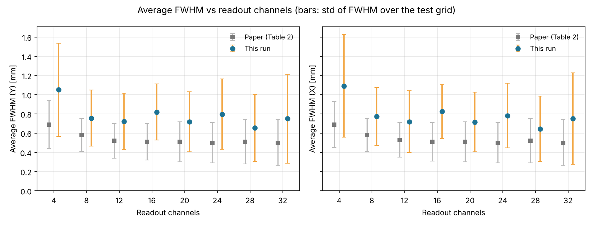

# SiPM multiplexing in a monolithic PET detector — a teaching re-implementation

An end-to-end, laptop-sized reproduction of the central experiment in

> Subedi, S. K., Cherry, S. R., Qiang, Y., & Peng, P. (2025).
> *Feasibility study of multiplexing analog signals from SiPMs for a single layer monolithic PET detector design.*
> **Radiation Measurements 182**, 107399. <https://doi.org/10.1016/j.radmeas.2025.107399>

**Please cite that article, not this repository alone** — it is the source of the method and the result.
[Citing](#citing) has the BibTeX.

**This is an independent educational re-implementation. It is not affiliated with, endorsed by, or verified by the
authors of that paper, and it is not a bit-exact reproduction.** It exists to make the method runnable and
inspectable end to end: simulate the light, multiplex it, train the decoder, and measure what accuracy costs.

---

## The question, and the answer

A 40 × 40 × 4 mm monolithic LSO plate is read out by 32 SiPMs along its four edges. Each 511 keV gamma
interaction produces a light pattern across those 32 sensors, and a CNN turns that pattern back into an
(x, y) position.

Thirty-two sensors means thirty-two readout channels, which is expensive. **Multiplexing** sums groups of
SiPM signals before digitisation — down to 28, 24, 20, 16, 12, 8 or 4 channels — trading electronics cost for
mixed-up position information.

**How much accuracy does that cost?** The paper's answer: almost none down to about 16 channels, then
degradation, with corner bias growing at the lowest channel counts. This code reproduces that trend.



Blue = this code (`medium` preset, one seed, Apple M1 GPU). Grey = the paper's Table 2.
Error bars are the standard deviation of the per-position FWHM across the test grid — the same definition the
paper uses. Regenerate with `plot_summary.py`; the numbers are in [`docs/paper_comparison.csv`](docs/paper_comparison.csv).

| Channels | This code, FWHM Y (mm) | Paper, FWHM Y (mm) | This code, RMS error (mm) |
|---|---|---|---|
| 32 | 0.75 ± 0.46 | 0.50 ± 0.24 | 0.63 |
| 28 | 0.65 ± 0.35 | 0.51 ± 0.23 | 0.57 |
| 24 | 0.80 ± 0.37 | 0.50 ± 0.21 | 0.53 |
| 20 | 0.72 ± 0.31 | 0.51 ± 0.21 | 0.51 |
| 16 | 0.82 ± 0.29 | 0.51 ± 0.19 | 0.51 |
| 12 | 0.72 ± 0.29 | 0.52 ± 0.18 | 0.51 |
| 8 | 0.76 ± 0.29 | 0.58 ± 0.17 | 0.59 |
| 4 | 1.05 ± 0.48 | 0.69 ± 0.25 | 1.14 |

**Read the trend, not the absolute numbers.** This code sits about 1.3–1.6× above the paper throughout, because
it uses a simplified optical simulation instead of GATE, far fewer events per position, a coarser calibration
grid and a smaller network. The error bars overlap the paper's at every channel count. See
[Honest limitations](#honest-limitations).

---

## Which version of the paper is referenced?

The study exists in two versions, and **this code was written from the preprint**:

| | |
|---|---|
| **Version of record — cite this** | *Radiation Measurements* **182** (2025) 107399, [doi:10.1016/j.radmeas.2025.107399](https://doi.org/10.1016/j.radmeas.2025.107399) |
| **What this code was built from** | SSRN preprint [4865116](https://ssrn.com/abstract=4865116) (not peer reviewed) |

**Every section, figure and table number in this repository refers to the preprint.** The published article
renumbers most of them. The references this repository actually makes map as follows — each row was checked
against both PDFs:

| Content | Preprint | Published article |
|---|---|---|
| Detector geometry, SiPM layout | Fig. 1 | Fig. 1 |
| Example light distributions | Fig. 2 | Fig. 2 |
| CNN architecture | Fig. 3 | Fig. 3 |
| Training / testing grids | Fig. 4 | Fig. 4 |
| **Multiplexing schemes (28 → 4 channels)** | **Fig. 8** | **Fig. 10** |
| 32-channel FWHM and bias maps | Fig. 9 | Fig. 11 |
| Per-scheme FWHM and bias maps | Fig. 11 | Fig. 13 |
| **Average FWHM vs channel count** | **Fig. 12** | **Fig. 14** |
| Corner MSE table | Table 1 | Table 1 (identical values, plus a fixed 5 × 5 grid variant) |
| **Per-scheme average FWHM ± σ** | **Table 2** | not in the main text |

The numbers in [`teaching_pipeline_v2/src/paper_reference.py`](teaching_pipeline_v2/src/paper_reference.py),
which the comparison plot above is drawn against, come from the **preprint's Table 2**. The Table 1 values there
were verified line by line against the published article and agree exactly.

---

## Two versions — which one should I run?

| | [`teaching_pipeline/`](teaching_pipeline/) (v1) | [`teaching_pipeline_v2/`](teaching_pipeline_v2/) (v2) |
|---|---|---|
| Physics and pipeline | identical | identical |
| Compute | CPU only | **CPU, Apple GPU (MPS) or NVIDIA (CUDA)** |
| Speed | baseline | ~4.7× faster training, ~2.4× faster simulation on an M1 |
| Metrics | FWHM, bias | FWHM, bias, **RMS error** |
| Paper comparison plot | — | **yes** (`plot_summary.py`) |
| Multi-seed runs, variant comparison | — | **yes** (`run_seeds.py`) |
| Error diagnostics | — | **yes** (`plot_errors.py`) |
| Optional training switches | — | **yes** (cosine LR, soft labels, off-grid epoch selection) |
| Tests | 8 | 18 |

**Use v2 unless you specifically want the simpler code.** v1 is kept because it is the smaller, easier
read — roughly 620 lines of source — and because it is the reference the v2 changes are measured against.
Every change between them is listed in [`teaching_pipeline_v2/CHANGELOG.md`](teaching_pipeline_v2/CHANGELOG.md).

---

## Quick start

Requires a **native** Python 3.10–3.13 (not conda — see [Environment notes](#environment-notes)).

```bash
git clone https://github.com/USERNAME/sipm-multiplexing-pet.git
cd sipm-multiplexing-pet/teaching_pipeline_v2

bash setup_env.sh                 # builds .venv and tests it (one time, a few minutes)
.venv/bin/python check_env.py     # expect "All checks passed"
.venv/bin/python -m pytest -q tests

bash run.sh --preset quick        # first real run, a minute or two
open results/quick                # macOS; use xdg-open on Linux
```

Then the full experiment and the paper comparison:

```bash
bash run.sh --preset medium --out results/medium        # all 8 channel counts
.venv/bin/python plot_summary.py results/medium         # -> fwhm_line.png + paper_comparison.csv
```

Every command for both versions is collected in [`COMMANDS.md`](COMMANDS.md).

### Presets

| Preset | Calibration grid | Events / position | Filters | Channel counts | Time (M1 GPU) |
|---|---|---|---|---|---|
| `quick` | 2 mm (400 classes) | 40 train / 60 test | 32 | 32, 16, 8, 4 | ~1 min |
| `medium` | 2 mm (400 classes) | 100 / 100 | 64 | all 8 | ~1–3 min |
| `paper` | **1 mm (1600 classes)** | 300 / 200 | 200 | all 8 | not measured; estimated tens of minutes to hours |

`paper` follows the paper's grid, filter count and class count. It has **not been run by the author of this
repository**, so its runtime and results are unverified. Time one epoch first:
`bash run.sh --preset paper --channels 32 --epochs 1 --out results/probe`.

---

## How it works

```
 gamma hit (x, y, z)                                     1 × C "grayscale image"
        │                                                          │
 optics_mc.py ──► 32 SiPM photon counts ──► multiplex.py ──► model.py (CNN) ──► softmax over N calibration
 (replaces GATE)        (Poisson noise)       (sum groups)   conv→BN→ReLU→FC     positions → centre of mass
                                                                                           │
                                                                  evaluate.py: per-position FWHM + bias + RMS
```

| Stage | Module | Paper section |
|---|---|---|
| Geometry, SiPM numbering S1–S32 | `src/geometry.py` | 2.1, Figs. 1, 8 |
| Optical Monte Carlo (replaces GATE) | `src/optics_mc.py`, `src/optics_mc_torch.py` | 2.1 |
| Training grid, half-pitch-offset test grid | `src/geometry.py`, `src/dataset.py` | 2.2, Fig. 4 |
| Multiplexing schemes, 28 → 4 channels | `src/multiplex.py` | 2.4, Fig. 8 |
| CNN + softmax centre of mass (Eq. 1) | `src/model.py`, `src/train.py` | 2.2, Fig. 3 |
| FWHM and bias per position | `src/evaluate.py` | 2.3 |
| Figures | `src/plots.py` | Figs. 2, 9, 11, 12 |
| The paper's published numbers, for comparison | `src/paper_reference.py` | Tables 1, 2 |

The key design decision is that **GATE/Geant4 is replaced by an analytic optical ray-trace**: isotropic photon
emission, specular ESR reflections handled by unfolding the thickness direction, absorbing side walls except at
the SiPM windows, Poisson shot noise. This is what makes the whole study run in minutes instead of days, and it
is also the main reason the absolute numbers differ from the paper's.

---

## Documentation

| File | What it covers |
|---|---|
| [`COMMANDS.md`](COMMANDS.md) | Every command for both versions, grouped by task |
| [`teaching_pipeline/GUIDE.md`](teaching_pipeline/GUIDE.md) | v1: what the code is, how it works, how to run it |
| [`teaching_pipeline/README.md`](teaching_pipeline/README.md) | v1: design notes, assumptions, troubleshooting |
| [`teaching_pipeline_v2/HOW_TO_RUN.md`](teaching_pipeline_v2/HOW_TO_RUN.md) | v2: step-by-step run guide, every CLI option, output layout, troubleshooting |
| [`teaching_pipeline_v2/README.md`](teaching_pipeline_v2/README.md) | v2: design notes, GPU support, training variants, assumptions |
| [`teaching_pipeline_v2/CHANGELOG.md`](teaching_pipeline_v2/CHANGELOG.md) | Every change from v1 to v2, and why |
| [`GITHUB_SETUP.md`](GITHUB_SETUP.md) | Publishing this repository (first-time git setup) |

---

## Honest limitations

These matter more than the numbers. Read them before quoting any result from this repository.

- **Not GATE.** The optical model is analytic and omits bulk absorption, Rayleigh scattering, refractive-index
  and critical-angle effects, and the UNIFIED surface model. Absolute FWHM is therefore optimistic or
  pessimistic in ways that have not been characterised.
- **Full-energy deposits only.** No Compton scatter, no escape, no 20 % energy window.
- **Fewer events.** 40–300 per position here, versus roughly 550–950 in the paper.
- **Coarse grid in `quick` and `medium`.** 2 mm instead of the paper's 1 mm. On this grid the classifier can
  "snap" onto a calibration point, which makes FWHM at that position look unrealistically small — sometimes
  near 0 mm. **This is why `summary.csv` also reports RMS error, which has no such artifact; prefer it.**
  `plot_errors.py` quantifies the effect. The `paper` preset reduces it.
- **One multiplexing scheme per channel count.** Only the paper's best-performing scheme is implemented, so the
  comparison between competing schemes at 16, 12, 8 and 4 channels is not reproduced. The 12-channel scheme is
  matched to the paper's Config 12a by name; the 16- and 4-channel schemes have **not** been verified against
  the paper's optimal Config 16b and 4b.
- **Single seed by default.** Differences of 0.05–0.1 mm between neighbouring channel counts are inside
  seed-to-seed noise. Use `run_seeds.py` before believing any small difference.
- **The optional v2 training switches are not from the paper.** `--lr-schedule cosine`, `--soft-label-sigma` and
  `--select-best offgrid` improve the numbers but move away from the published method. They are off by default.
  A better number obtained with them is **not** a better reproduction.
- **The `paper` preset has never been run.** Every runtime estimate for it in this repository is extrapolation.
- **Several parameters are assumptions**, marked `[assumed]` in `src/config.py`: light yield, kernel size,
  epochs, batch size, momentum, events per position.

---

## Environment notes

On macOS, mixing conda and pip can put **two OpenMP runtimes** in one process, which produces
`OMP: Error #15` or a segmentation fault when NumPy and PyTorch are loaded together. The usual
`KMP_DUPLICATE_LIB_OK=TRUE` workaround hides the message without making it safe.

`setup_env.sh` avoids the problem by building a clean, pip-only `.venv` from a **native, non-conda**
Python 3.10–3.13. `check_env.py` diagnoses an environment and names the failing step. On Apple Silicon,
Python must be arm64 (not Rosetta) or PyTorch cannot see the GPU.

---

## Repository layout

```
.
├── README.md                  this file
├── COMMANDS.md                every command, both versions
├── GITHUB_SETUP.md            how to publish this repo
├── LICENSE                    MIT
├── CITATION.cff               how to cite this code and the paper
├── docs/                      figures used by this README
├── .github/workflows/         CI: tests + a smoke run on every push
├── teaching_pipeline/         v1, CPU only
│   ├── GUIDE.md  README.md
│   ├── run_all.py  check_env.py  setup_env.sh  run.sh
│   ├── src/                   config, geometry, optics_mc, multiplex, dataset,
│   │                          model, train, evaluate, plots, envcheck
│   ├── tests/                 8 tests
│   └── example_results/       committed reference output
└── teaching_pipeline_v2/      v2, GPU-enabled
    ├── HOW_TO_RUN.md  README.md  CHANGELOG.md
    ├── run_all.py  run_seeds.py  plot_summary.py  plot_errors.py  benchmark.py
    ├── check_env.py  setup_env.sh  run.sh
    ├── src/                   v1 modules + device, optics_mc_torch, paper_reference
    ├── tests/                 18 tests
    └── example_results/       committed reference output
```

`results/` is generated and git-ignored. `example_results/` is committed so the outputs can be seen
without running anything.

---

## Not included in this repository

Neither PDF of the paper (the Elsevier published article and the SSRN preprint), nor a slide deck built from
its figures, is committed — they are copyright of their authors and publishers. `.gitignore` excludes `*.pdf`
and `*.pptx` so they cannot be added by accident. Get the published article from
[doi.org/10.1016/j.radmeas.2025.107399](https://doi.org/10.1016/j.radmeas.2025.107399) and the preprint from
[ssrn.com/abstract=4865116](https://ssrn.com/abstract=4865116).

The numbers in `src/paper_reference.py` are the published results from Tables 1 and 2, transcribed for
numerical comparison.

---

## Citing

If this code is useful to you, **cite the paper** — it is the source of the method and the result. This
repository is a re-implementation and adds no new findings.

```bibtex
@article{Subedi2025SiPMMultiplexing,
  title   = {Feasibility study of multiplexing analog signals from {SiPMs}
             for a single layer monolithic {PET} detector design},
  author  = {Subedi, Shiv K. and Cherry, Simon R. and Qiang, Yi and Peng, Peng},
  journal = {Radiation Measurements},
  volume  = {182},
  pages   = {107399},
  year    = {2025},
  issn    = {1350-4487},
  doi     = {10.1016/j.radmeas.2025.107399},
}
```

The preprint this code was written from, if you need to refer to its section or figure numbering:

```bibtex
@misc{Subedi2024SiPMMultiplexingPreprint,
  title  = {Feasibility study of multiplexing analog signals from {SiPMs}
            for a single layer monolithic {PET} detector design},
  author = {Subedi, Shiv K. and Cherry, Simon R. and Qiang, Yi and Peng, Peng},
  year   = {2024},
  note   = {SSRN preprint 4865116, not peer reviewed},
  url    = {https://ssrn.com/abstract=4865116},
}
```

If you also want to point at this implementation, [`CITATION.cff`](CITATION.cff) is the machine-readable
record and GitHub's "Cite this repository" button reads it.

## License

[MIT](LICENSE) for the code in this repository. The paper and its figures are not covered by this license.
